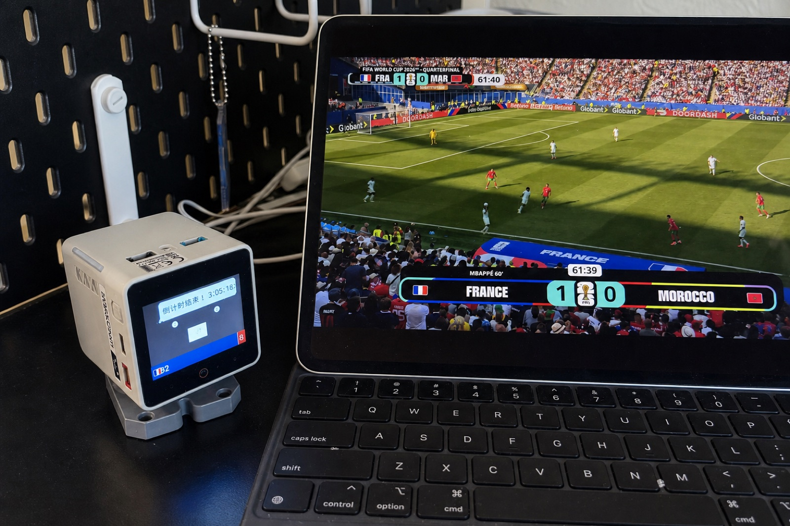
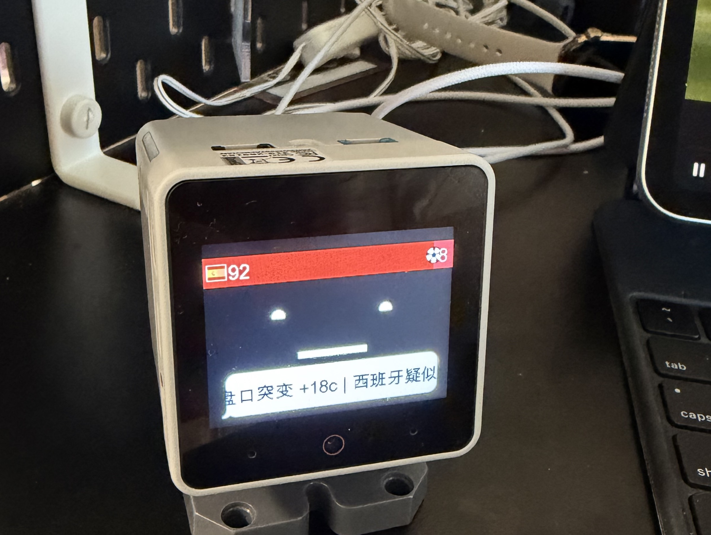
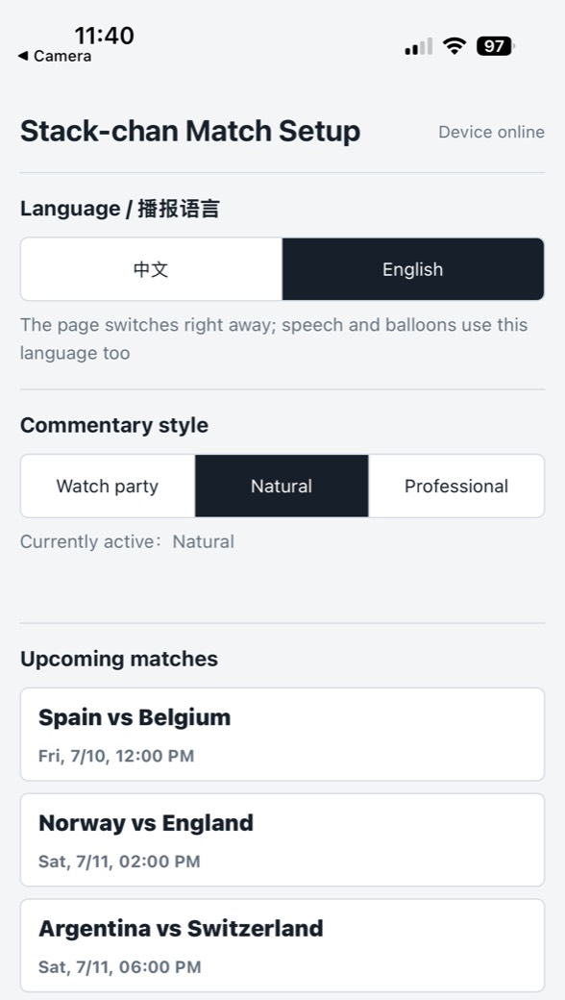
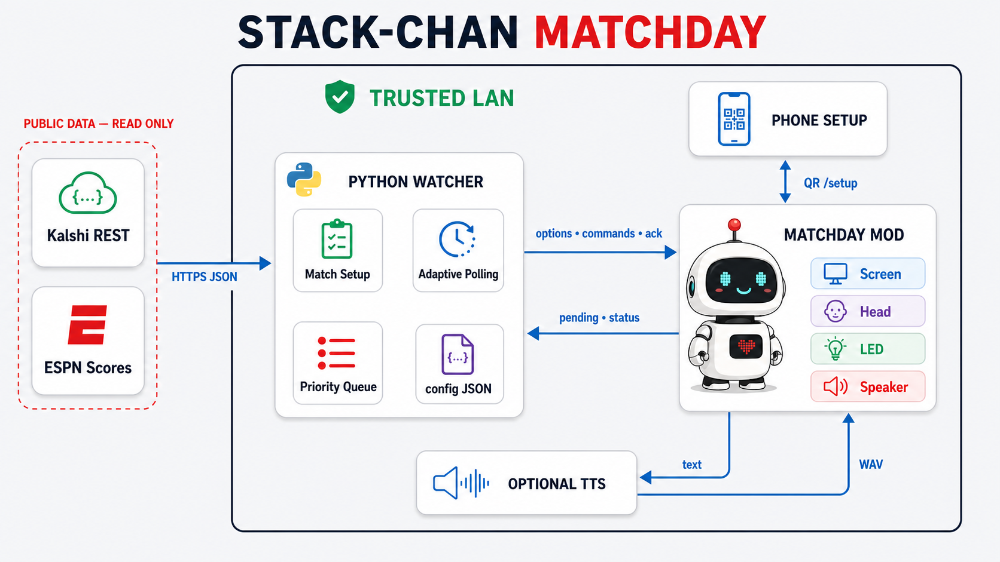

# Stack-chan Matchday

[English](README.md) | [简体中文](README.zh-CN.md)

Stack-chan Matchday is a lightweight [Stack-chan](https://github.com/stack-chan/stack-chan)
mod and Python LAN watcher that turn a CoreS3 robot into a World Cup
co-watching companion. It shows both teams' Kalshi advance-market
probabilities, follows ESPN scores and live commentary, reacts with speech,
balloons, lights, and safe head movements, and lets you choose the next match
from a phone.

> [!IMPORTANT]
> This is a read-only match companion. It does not trade, access a Kalshi
> account, or provide betting advice. A position is a manually entered
> preference, never a real-account holding. Kalshi data comes from its public
> REST API; ESPN data comes from publicly reachable, undocumented endpoints
> that may change or lag behind the broadcast.

## In action

<table>
  <tr>
    <td colspan="2" align="center">
      <br>
      <sub>Watching together: Stack-chan follows the same match beside the screen.</sub>
    </td>
  </tr>
  <tr>
    <td align="center" width="68%">
      <br>
      <sub>Live reaction: a 92–8 split and an on-screen market-move alert.</sub>
    </td>
    <td align="center" width="32%">
      <br>
      <sub>Choose a match, perspective, position, language, and commentary style.</sub>
    </td>
  </tr>
</table>

## How to use

1. **Start the watcher.** Keep the watcher computer awake and the `--watch`
   process running. The phone, computer, and Stack-chan must share a trusted
   LAN.
2. **Open Match Setup.** Double-tap the touch bar on Stack-chan's head, or
   briefly press Power, to show the setup QR. Scan it with your phone.
3. **Choose what to watch.** Select a match, supported team (or Neutral),
   optional pregame position (or No position), commentary style, and whether
   to use spoiler protection, then tap **Start watching**.
4. **Wait for confirmation.** The watcher validates the ESPN/Kalshi pairing,
   updates its configuration, and acknowledges the device. The new selection
   takes effect without restarting the watcher or device. Changing only the
   commentary style does not replay old events.

During the match, hold the top touch bar for about one second to toggle the
boss-key mute. Speech, tones, celebrations, and alert lights stop while the
probability bar, balloons, and ticker continue updating. If no fixture is
available, paste a Kalshi event URL or ticker into Match Setup to follow its
four most-traded markets in standalone mode.

See [Configuration and operation](docs/configuration.md) for daily prompts,
language, support and position behavior, commentary styles, mute controls, and
standalone-market details.

## System design



Kalshi and ESPN are read-only inputs to the Python watcher. The watcher
discovers fixtures, validates market pairing, parses events into shared facts,
renders the selected commentary style, and sends options, acknowledgements,
display, speech, and reaction commands to the Matchday mod.

The mod hosts the phone setup page, forwards pending settings, and plays the
resulting commands. Commentary styling does not modify the official host
firmware or TTS module. Optional speech uses a LAN `/say?text=...` service that
returns a 24 kHz mono 16-bit PCM WAV response.

The device stores a pending phone selection until the watcher validates it,
atomically updates the local JSON configuration, hot-reloads, and acknowledges
the device. The phone, watcher, TTS server, and Stack-chan must remain on the
same trusted LAN; the watcher-hosted `:8788/setup` page is a local fallback,
not the primary QR flow.

## Features

- Persistent two-team probability bar, flags, and a bottom market ticker.
- Reactions to goals, cards, substitutions, close misses, match phases, and
  final results.
- Casual, balanced, and professional commentary generated from shared event
  facts, with compact on-device balloons.
- Separate support and position perspectives, including explicit conflict and
  uncertain-event wording.
- Optional spoiler protection suppresses proactive Kalshi alerts while
  confirmed ESPN events and passive probability/ticker updates continue.
- Phone-based match setup with live Chinese/English switching and hot reload.
- Automatic fixture discovery, adaptive polling, quiet hours, and standalone
  market tracking when no match is available.
- Optional LAN TTS; visual feedback and tone patterns still work without it.
- A global ESPN athlete-ID catalog with manually verified Chinese names and
  nicknames.

## Quick start

### Daily start

Update the repository and restart the watcher. Support/position wording,
position-based market selection, and the global player catalog remain
watcher-only changes. The phone spoiler-protection switch requires Matchday
Mod 1.6.0, but the official host can stay in place.

```sh
python3 tools/stackchan_kalshi_watch.py \
  --config config/kalshi_watchlist.json --watch
```

Deploy `config/espn_player_catalog.json` with the watcher checkout. For exact
upgrade boundaries, see the bilingual
[Matchday MOD 1.7.0 multi-venue notes](docs/releases/1.7.0.md),
[1.6.0 notes](docs/releases/1.6.0.md),
[1.5.0 notes](docs/releases/1.5.0.md), and
[1.4.0 commentary-style notes](docs/releases/1.4.0.md).

### First installation

You need a CoreS3 Stack-chan with 16 MB flash, Python 3.10+, Node.js 20+,
Moddable SDK, ESP-IDF, a USB data cable, and a phone and watcher computer on
the same trusted LAN. macOS is required only for the included `say`-based TTS
server.

Follow [Getting started](docs/getting-started.md) for the tested upstream
revision, one-time host preparation, QR generation, mod installation, watcher
configuration, TTS, and verification. Host partition and optional CJK-font
patch details live in [host/README.md](host/README.md).

### Upgrade

Before updating, open the [release notes directory](docs/releases/) and check
which boundary changed: watcher, Matchday mod, or official host. Preserve the
local watcher configuration and update only the affected layer. Watcher-only
changes normally need a repository update and watcher restart, while mod or
host changes must follow the version-specific build and flash instructions.
The currently documented device release is [Matchday Mod 1.5.0](docs/releases/1.5.0.md).

## Documentation

| Guide | Contents |
| --- | --- |
| [Getting started](docs/getting-started.md) | Requirements, host/mod installation, watcher, TTS, verification |
| [Configuration and operation](docs/configuration.md) | Language, perspectives, player catalog, styles, mute, standalone mode |
| [Device API](docs/device-api.md) | Commands, status, control, and Match Setup relay endpoints |
| [Development](docs/development.md) | Repository map, tests, archive builds, and replay tooling |
| [Host preparation](host/README.md) | Partition and optional CJK-font patches |
| [Commentary styles PRD](docs/commentary-styles-prd.md) | Product rules and implementation contract |
| [Release notes](docs/releases/1.7.0.md) | Version-specific upgrade boundaries |
| [Venue adapter contract](docs/venue-adapter-api.zh-CN.md) | Normalized quotes and multi-venue aggregation rules |
| [GitHub Wiki](https://github.com/xymeow/stackchan-matchday/wiki) | Human- and agent-friendly navigation, FAQ, and field debugging |

English guides link to their Chinese counterparts at the top of each page.
Repository documentation is the versioned source of truth; the Wiki is the
short operational index and troubleshooting layer.

### Compatibility notes

- The watcher uses Python's standard library for the default HTTP workflow;
  serial transport additionally requires `pyserial`.
- Phone setup, device status detection, and the pending/ack relay require HTTP.
- The example `KXEXAMPLE-...` tickers are placeholders. Select a live fixture
  from Match Setup or replace them with real open markets.
- ESPN endpoints are unofficial. Missing or ambiguous upstream detail is
  ignored rather than translated into a guessed football fact.
- Commentary style can change during a match without resetting ESPN history,
  market baselines, queues, or polling state. API compatibility is documented
  in the [Device API guide](docs/device-api.md).
- Spoiler protection can also change live. It silences proactive Kalshi
  alerts, not the passive probability bar or ticker, and never suppresses
  confirmed ESPN events.

### For maintainers and AI agents

- Repository docs are versioned with the code and are the source of truth for
  build parameters, interfaces, and configuration behavior.
- The Wiki is for environment-specific field knowledge; do not keep partition
  offsets or version-bound commands only in the Wiki.
- The watcher owns data parsing and copy; the mod relays configuration and
  performs device feedback; the host provides partitions and fonts.
- When behavior changes, update the relevant guide, example configuration, and
  release notes instead of expanding the README with implementation details.

## Security

The device HTTP API is unauthenticated and CORS-open by design. Use it only on
a trusted LAN; do not port-forward TCP `80`, `8787`, or `8788`. The fallback AP
(`StackChan-Matchday` / `stackchan`) appears only when the device has no Wi-Fi
credentials. Configure Wi-Fi with the official
[Stack-chan web console](https://stack-chan.github.io/stack-chan/web/preference/) over BLE before
starting the watcher.

## Credits and licenses

- [Stack-chan](https://github.com/stack-chan/stack-chan) by Shinya Ishikawa —
  Apache-2.0.
- Flag PNGs derived from [flag-icons](https://github.com/lipis/flag-icons) —
  MIT; see `mod/LICENSE-flag-icons.txt`.
- This repository — [MIT](LICENSE).
