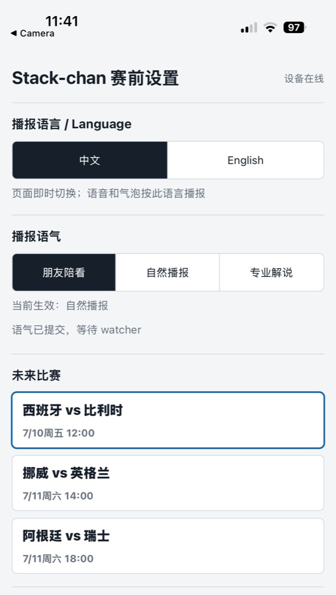

# Stack-chan Matchday

[English](README.md) | [简体中文](README.zh-CN.md)

Stack-chan Matchday 是一个轻量的
[Stack-chan](https://github.com/stack-chan/stack-chan) Mod 与 Python 局域网
watcher，可把 CoreS3 机器人变成世界杯陪看搭子：屏幕持续显示双方在 Kalshi
晋级市场中的概率，跟随 ESPN 比分与文字直播，并通过语音、气泡、灯光和安全幅度的
头部动作做出反应。下一场看什么，直接用手机选择。

> [!IMPORTANT]
> 这是一个只读的比赛陪看工具。它不会交易、不会访问 Kalshi 账户，也不提供投注
> 建议。`position_team` 只是手动填写的偏好；Kalshi 数据来自公开 REST API，ESPN
> 数据来自可公开访问但未正式文档化的接口，可能变更，也可能落后于电视直播。

## 实机效果

<table>
  <tr>
    <td colspan="2" align="center">
      <br>
      <sub>一起看球：Stack-chan 在屏幕旁跟随同一场比赛。</sub>
    </td>
  </tr>
  <tr>
    <td align="center" width="68%">
      <br>
      <sub>实时反应：92–8 概率与设备端盘口变化提示。</sub>
    </td>
    <td align="center" width="32%">
      <br>
      <sub>中文设置页：切换播报语言和语气，并等待 watcher 确认。</sub>
    </td>
  </tr>
</table>

<details>
<summary>🥚 彩蛋</summary>

我买🇧🇪了，猜猜明天我会不会上天台🤣

<sub>这里的“持仓”只由你手动选择；Stack-chan 不读取账户，也不会下单。</sub>

</details>

## 如何使用

1. **启动 watcher。** 保持 watcher 电脑唤醒，并让 `--watch` 进程持续运行；手机、
   电脑和 Stack-chan 必须位于同一个可信局域网。
2. **唤出设置码。** 双击头顶触摸条或短按 Power 键，屏幕会显示设置二维码；轻点
   一次可关闭，90 秒后也会自动关闭。
3. **用手机选择。** 扫码后选择语言、比赛、支持队、可选持仓、播报语气和是否开启
   防剧透，再点“开始看球”。页面显示 watcher 已确认后，配置立即生效，无需重启。
4. **一起看球。** Stack-chan 会持续更新旗帜、概率和 ticker，并响应比分、文字直播
   与盘口变化。

长按头顶触摸条约一秒可切换静音：语音、音效、庆祝动作和警报灯停止，概率条、气泡
和 ticker 继续更新。没有球赛时，也可在同一页面粘贴 Kalshi event URL 或 ticker，
单独跟踪最多四个活跃市场。更多选项见[配置与播报](docs/configuration.zh-CN.md)。

<table>
  <tr>
    <td align="center" width="38%">
      <br>
      <sub>扫描设备二维码，打开局域网设置页。</sub>
    </td>
    <td align="center" width="62%">
      <br>
      <sub>长按进入静音；视觉信息继续更新。</sub>
    </td>
  </tr>
</table>

## 系统设计


Kalshi 和 ESPN 只作为 Python watcher 的只读数据源。watcher 负责解析统一的比赛
事实、生成三档文案，并向设备发送显示、语音和动作命令；Mod 负责手机设置转发与设备
反馈，不修改官方 host runtime 或 TTS 模块。

手机访问 Stack-chan 自己的 `/setup` 页面。设备先保存待处理选择，watcher 再完成
校验、原子更新本地 JSON、热重载并确认设备。可选的局域网 TTS 接收设备发出的
`/say?text=...` 请求，返回 24 kHz、单声道、16-bit PCM WAV。

watcher 电脑上的 `:8788/setup` 只是默认绑定回环地址的本机管理后备页，不是设备
二维码的主流程。

```text
Kalshi + ESPN ──只读──> Python watcher ──HTTP──> Stack-chan Matchday Mod
                              │                         │
                              └── 配置校验与确认 <── 手机 /setup
                                                        │
                                                        └── 可选局域网 TTS
```

## 功能

- 常驻双方概率条、球队旗帜与底部市场 ticker。
- 对进球、红黄牌、换人、险情、比赛阶段和赛果做出反应。
- `casual`、`balanced`、`professional` 三档播报语气，可在比赛中即时切换。
- 支持队和持仓队分开建模；重大事件会自然说明持仓利好或利空。
- 可选防剧透模式：关闭 Kalshi 主动提醒，同时保留 ESPN 已确认事件与静默更新的
  概率条和 ticker。
- 由设备托管的中英文手机设置页，以及 watcher 的配置热更新与确认链路。
- 自动发现比赛、自适应轮询、免打扰时段和无比赛市场跟踪。
- 可选局域网 TTS；服务不可用时，视觉反馈和提示音仍然工作。
- 以 ESPN athlete ID 为主键的全局球员目录；只使用人工核实的中文名和昵称。

## 快速开始

### 日常启动

已有仓库和有效配置时，在仓库根目录保持 watcher 电脑唤醒并运行：

```sh
python3 tools/stackchan_kalshi_watch.py \
  --config config/kalshi_watchlist.json --watch
```

示例 ticker 是占位值；从手机设置页选择真实比赛后，watcher 会校验 ESPN 与 Kalshi
的双方匹配并原子更新配置。旧版升级前请查看
[Matchday Mod 1.7.0 多盘口说明](docs/releases/1.7.0.md)、
[1.6.0 说明](docs/releases/1.6.0.md)及[全部版本说明](docs/releases/)；
设备手机页的防剧透开关需要更新 watcher 与 Mod，但无需重刷官方 host。
日常启动不需要 `git pull`、重新克隆或刷机。需要语音时，再启动
[安装与升级](docs/getting-started.zh-CN.md)中说明的可选局域网 TTS 服务。

### 首次安装

- 基于 CoreS3、配备 16 MB Flash 的 Stack-chan，以及一根可传数据的 USB 线。
- Git、Python 3.10+、Node.js 20+、npm、`xz`、Moddable SDK 与 ESP-IDF。
- 手机、watcher 电脑和 Stack-chan 位于同一个可信局域网。
- 只有生成设备专属二维码时需要 `qrencode`；仓库自带的 TTS 服务仅支持 macOS。

首次安装需要准备并烧录一次官方 host、生成设备二维码、安装 Matchday Mod，再配置
watcher。完整、可复现的命令见[安装与升级](docs/getting-started.zh-CN.md)；host 的分区
和可选 CJK 字体步骤以 [host/README.zh-CN.md](host/README.zh-CN.md) 为准。

示例 ticker 是占位值；从手机设置页选择真实比赛后，watcher 会校验 ESPN 与 Kalshi
的双方匹配并原子更新配置。

### 升级

更新前先查看[全部版本说明](docs/releases/)，确认变化属于 watcher、Matchday Mod
还是官方 host，并保留本地 watcher 配置，只更新受影响的层。watcher-only 变化通常只需
更新仓库并重启 watcher；涉及 Mod 或 host 时，必须按对应版本说明构建和刷写。当前
设备版本的直接入口是 [Matchday Mod 1.5.0](docs/releases/1.5.0.md)。

## 文档

| 想做什么 | 文档 |
| --- | --- |
| 首次安装、升级、Mod 构建、watcher 与 TTS 启动 | [安装与升级](docs/getting-started.zh-CN.md) |
| 调整语言、语气、支持/持仓、球员目录和轮询 | [配置与播报](docs/configuration.zh-CN.md) |
| 构建或重新烧录官方 host、加入中文字体 | [Host firmware](host/README.zh-CN.md) |
| 调用设备命令、状态与 Match Setup 接口 | [设备 API](docs/device-api.zh-CN.md) |
| 运行测试、构建归档和回放比赛 | [开发指南](docs/development.zh-CN.md) |
| 理解三档语气的产品规则 | [播报语气 PRD](docs/commentary-styles-prd.md) |
| 多品类、多盘口的演进方向 | [多品类·多盘口 PRD](docs/multi-venue-roadmap-prd.zh-CN.md)、[VenueAdapter 契约](docs/venue-adapter-api.zh-CN.md) |
| 查看版本差异与升级边界 | [版本说明](docs/releases/) |
| 处理联网、二维码、TTS、xsbug 等常见问题 | [排障与 FAQ（Wiki）](https://github.com/xymeow/stackchan-matchday/wiki/Troubleshooting) |

### 兼容性说明

- watcher 的默认 HTTP 工作流只使用 Python 标准库；串口传输还需要 `pyserial`。
- 手机设置、设备状态检测和 pending/ack 转发链路依赖 HTTP。
- 示例中的 `KXEXAMPLE-...` ticker 只是占位值；请从手机设置页选择实时比赛，或替换为
  仍在交易的真实市场。
- ESPN 接口并非正式 API；缺失或含糊的上游细节会被忽略，不会猜测足球事实。
- 比赛中切换语气不会重置 ESPN 历史、盘口基线、队列或轮询状态；API 兼容性见
  [设备 API](docs/device-api.zh-CN.md)。
- 防剧透也可在比赛中即时切换：只关闭 Kalshi 主动提醒，不隐藏概率条或 ticker，
  也不会屏蔽 ESPN 已确认事件。

### 给维护者和 AI agent

- 仓库内文档与代码一起版本化，是构建参数、接口和配置行为的事实来源。
- Wiki 用于环境相关的排障经验；不要只在 Wiki 保存分区偏移或版本绑定的命令。
- watcher 拥有数据解析和文案；Mod 只转发配置并执行设备反馈；host 只提供分区和字体。
- 修改行为时同步更新对应文档、示例配置和版本说明，避免 README 再次堆积实现细节。

## 安全

设备 HTTP API 按设计不设认证并开放 CORS。只应在可信局域网使用，不要转发 TCP
`80`、`8787` 或 `8788`。设备没有 Wi-Fi 凭据时才会出现后备 AP
（`StackChan-Matchday` / `stackchan`）。启动 watcher 前，请通过 BLE 使用官方
[Stack-chan Web Console](https://stack-chan.github.io/stack-chan/web/preference/) 配置 Wi-Fi。

## 致谢与许可证

- Shinya Ishikawa 的 [Stack-chan](https://github.com/stack-chan/stack-chan) —
  Apache-2.0。
- 旗帜 PNG 来源于 [flag-icons](https://github.com/lipis/flag-icons) — MIT；详见
  `mod/LICENSE-flag-icons.txt`。
- 本仓库 — [MIT](LICENSE)。
