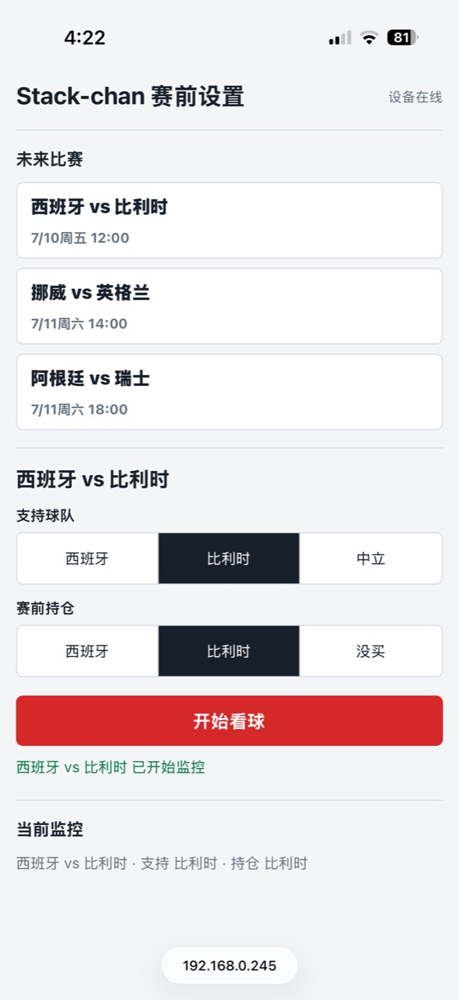

# Stack-chan Matchday

[English](README.md) | [简体中文](README.zh-CN.md)

Stack-chan Matchday 是一个轻量的
[Stack-chan](https://github.com/stack-chan/stack-chan) Mod 与 Python
局域网 watcher，可把 CoreS3 机器人变成世界杯陪看搭子：屏幕持续显示双方在
Kalshi 晋级市场中的概率，跟随 ESPN 比分与文字直播，并通过语音、气泡、灯光和
安全幅度的头部动作做出反应；下一场看什么，可以直接用手机选择。

> [!IMPORTANT]
> 这是一个只读的比赛陪看工具。它不会交易、不会访问 Kalshi 账户，也不提供投注
> 建议。`position_team` 只是手动填写的偏好，仅用于选择终场反应。Kalshi 数据来自
> 其公开 REST API；ESPN 数据来自可公开访问但未正式文档化的接口，可能变更，也
> 可能落后于电视直播。

## 功能

- 常驻的双方概率条、球队旗帜与底部市场 ticker。
- 对进球、红黄牌、换人、险情、比赛状态和终场结果做出反应。
- 由 Stack-chan 自己托管的手机设置页，可即时切换中英文。
- 双击头顶触摸条或短按 Power 键唤出设置二维码。
- 自动发现比赛、自适应轮询、配置热更新与免打扰时段。
- 可选局域网 TTS；没有 TTS 时，视觉反馈和提示音仍然可用。
- 没有比赛时，也可单独跟踪一个事件中最多四个活跃市场。

## 实机效果

<table>
  <tr>
    <td colspan="2" align="center">
      <br>
      <sub>一起看球：Stack-chan 在屏幕旁跟随同一场比赛。</sub>
    </td>
  </tr>
  <tr>
    <td align="center" width="68%">
      <br>
      <sub>设备端实时概率条</sub>
    </td>
    <td align="center" width="32%">
      <br>
      <sub>手机选择比赛、支持球队和手动赛前持仓</sub>
    </td>
  </tr>
</table>

<details>
<summary>🥚 彩蛋</summary>

我买🇧🇪了，猜猜明天我会不会上天台🤣

<sub>这里的“持仓”只由你手动选择；Stack-chan 不读取账户，也不会下单。</sub>

</details>

## 系统设计


Kalshi 和 ESPN 只作为 Python watcher 的只读数据源。watcher 向 Matchday Mod
发送可选比赛、显示命令和设置确认。手机访问的是 Stack-chan 自己的 `/setup`
页面：设备先保存待处理选择，watcher 再完成校验、原子更新本地 JSON 配置、热重载，
最后确认设备。播报时，Stack-chan 主动向可选局域网 TTS 服务请求
`/say?text=...`，并接收 24 kHz、单声道、16-bit PCM WAV。

手机、watcher 电脑、TTS 服务和 Stack-chan 必须处于同一个可信局域网。
watcher 电脑上的 `:8788/setup` 只是可选的本机管理后备页，不是扫码主流程。

## 仓库结构

- `mod/` — 设备端 Mod，由多个小型 JS 模块以及旗帜、二维码资源组成。
- `host/` — CoreS3 必需的分区补丁、可选 CJK 字体补丁和字体准备脚本。这些只是
  构建/资源层改动，不修改上游 runtime JS/C 源码。
- `tools/` — watcher、本地设置服务、macOS TTS 服务、比赛回放、串口辅助工具、
  素材生成器与测试。默认 HTTP 流程只用 Python 标准库；串口模式另需
  `pyserial`。
- `config/` — watcher 示例配置与旗帜包定义。

## 环境要求

- 基于 CoreS3、配备 16 MB Flash 的 Stack-chan，以及一根可传数据的 USB 线。
- 构建电脑上安装 Git、Python 3.10+、Node.js 20+（上游已测试 Node.js 22）、
  npm 和 `xz`。
- Moddable SDK 与 ESP-IDF；下文的上游 `xs-dev` 命令会负责安装并检查。
- 手机、watcher 电脑和 Stack-chan 位于同一个可信局域网。
- 只有生成设备专属二维码时才需要 `qrencode`。
- 仓库自带的 `say` TTS 服务仅支持 macOS；其他系统可以不启用语音，或自行提供
  兼容的 `/say` WAV 服务。

下列命令适用于 macOS/Linux shell。先设置两个绝对路径，后续安装始终沿用：

```sh
mkdir -p "$HOME/src"
export MATCHDAY_DIR="$HOME/src/stackchan-matchday"
export STACKCHAN_DIR="$HOME/src/stack-chan"
```

## 安装

### 1. 克隆仓库并准备上游构建环境

```sh
git clone https://github.com/xymeow/stackchan-matchday.git "$MATCHDAY_DIR"
git clone https://github.com/stack-chan/stack-chan.git "$STACKCHAN_DIR"

cd "$STACKCHAN_DIR"
git switch --detach ded5ca94ef50411aec213b85a23d1afe72d4c29e

cd "$STACKCHAN_DIR/firmware"
npm ci
npm run setup -- --device=esp32
npm run doctor
```

这个固定 commit 是本仓库补丁测试过的基线。只有在 `npm run doctor` 把 `esp32`
列为 supported target 后，才继续构建。若 `xs-dev` 提示平台相关依赖，请查看上游
[环境配置说明](https://github.com/stack-chan/stack-chan/blob/dev/v1.0/firmware/docs/getting-started.md)。

### 2. 应用补丁并烧录一次 host

每个新的 CoreS3 host checkout 都必须应用分区补丁：

```sh
cd "$STACKCHAN_DIR"
git am "$MATCHDAY_DIR/host/patches/0001-Add-xs-mod-partition-for-M5StackChan-CoreS3.patch"
```

要显示中文标签和气泡，还需应用字体补丁并准备一份支持 CJK 的 TTF。纯英文安装
可以跳过下面两条命令，并把 watcher 的语言设为 `en`：

```sh
git am "$MATCHDAY_DIR/host/patches/0002-Add-optional-StackChanCN-24-GB2312-font-resource.patch"
python3 "$MATCHDAY_DIR/host/prepare_cjk_font.py" "$STACKCHAN_DIR"
```

构建并烧录 host：

```sh
cd "$STACKCHAN_DIR/firmware"
export PATH="$PWD/node_modules/.bin:$PATH"
mcconfig -d -m -p esp32:./platforms/m5stackchan_cores3 -t deploy \
  "$PWD/stackchan/manifest_m5stackchan_cores3.json"
```

字体选择与补丁细节见 [host/README.zh-CN.md](host/README.zh-CN.md)。

### 3. 先生成二维码，再构建并安装 Mod

二维码是编译进 Mod 的静态图片，运行时不会自动重画。请先为设备设置稳定的 DHCP
保留地址、IP 或可解析的 mDNS 名称，然后在安装 Mod 前生成二维码。UI 会读取 PNG
的实际尺寸；请让宽和高都不超过 168 px，以便标题和 URL 仍能完整显示：

```sh
export STACKCHAN_HOST=stackchan.local
qrencode -s 4 -m 1 -o "$MATCHDAY_DIR/mod/assets/setup/setup-qr.png" \
  "http://$STACKCHAN_HOST/setup"
file "$MATCHDAY_DIR/mod/assets/setup/setup-qr.png"
```

如果 `file` 显示任一边超过 168 px，请改用 `-s 3` 重新生成。然后构建并安装
Mod：

```sh
cd "$STACKCHAN_DIR/firmware"
npm run mod --target=esp32:./platforms/m5stackchan_cores3 -- -f rgb565be \
  "$MATCHDAY_DIR/mod/manifest.json"
```

CoreS3 必须使用 `-f rgb565be`，否则旗帜颜色会发生字节序错位。随后从 watcher
电脑验收 Mod：

```sh
curl "http://$STACKCHAN_HOST/health"
curl "http://$STACKCHAN_HOST/api/status"
```

### 4. 配置并启动 watcher

```sh
cp "$MATCHDAY_DIR/config/kalshi_watchlist.example.json" \
  "$MATCHDAY_DIR/config/kalshi_watchlist.json"
```

编辑复制出的文件，确认：

- `stackchan_host` 与 `$STACKCHAN_HOST` 或设备局域网 IP 一致。
- `stackchan_transport` 是 `http`；手机设置中继不支持串口模式。
- `setup_server.enabled` 是 `true`。
- 端口 `8788` 未被占用。默认绑定 `127.0.0.1`，因此可选的本机管理页不会暴露到
  局域网。

检查 JSON 后，让 watcher 持续运行：

```sh
python3 -m json.tool "$MATCHDAY_DIR/config/kalshi_watchlist.json"
python3 "$MATCHDAY_DIR/tools/stackchan_kalshi_watch.py" \
  --config "$MATCHDAY_DIR/config/kalshi_watchlist.json" --watch
```

示例中的 `KXEXAMPLE-...` 是有意保留的占位 ticker。在手机选择真实比赛或手动
换成开放 ticker 之前，watcher 可能报告它们 missing。`--dry-run` 只会阻止写入
设备，仍会访问公开 API，不能当作离线安装验收。

### 5. 可选：启用局域网语音

在 macOS 的第二个终端里重新导出仓库路径，再以前台方式启动自带服务，便于直接
看到错误：

```sh
export MATCHDAY_DIR="$HOME/src/stackchan-matchday"
python3 "$MATCHDAY_DIR/tools/stackchan_tts_server.py" --host 0.0.0.0 --port 8787
```

保持这个终端运行。在另一个终端中先验收服务，再让设备连接 watcher 电脑的局域网
地址，而不是 `127.0.0.1`：

```sh
curl "http://127.0.0.1:8787/health"
export STACKCHAN_HOST=stackchan.local
export WATCHER_HOST=192.168.1.20
curl --request POST --data-binary "tts host $WATCHER_HOST:8787" \
  "http://$STACKCHAN_HOST/api/command"
curl --request POST --data-binary "say 比赛日准备好了" \
  "http://$STACKCHAN_HOST/api/command"
```

请在电脑防火墙中允许 TCP `8787` 入站。用 `say -v '?'` 查看 macOS 已安装的
声音；可通过 `STACKCHAN_TTS_ZH_VOICE`、`STACKCHAN_TTS_EN_VOICE` 和
`STACKCHAN_TTS_RATE` 覆盖默认值。TTS 不可达时，Mod 会自动回退到短提示音。

## 如何使用

1. **先启动 watcher。** 保持 watcher 电脑唤醒，并让 `--watch` 进程持续运行；
   手机、电脑和 Stack-chan 必须在同一个可信局域网。
2. **摸头唤出设置码。** 双击 Stack-chan 头顶的三段触摸条，屏幕会显示设置二维码；
   显示时轻点一次可关闭，90 秒后也会自动关闭。在固定的 host firmware 上，短按
   Power 键同样可以开关二维码。
3. **扫码选择比赛。** 用手机打开二维码，选择中文或 English、要看的比赛、支持
   球队（也可中立）以及可选的赛前持仓（也可“没买”），再点“开始看球”。赛前持仓
   只是手动的终场反应偏好，系统不会读取账户。
4. **等待确认。** 页面会先显示“已提交，等待 watcher”。watcher 会校验 ESPN 与
   Kalshi 的双方匹配，原子更新本地配置、热重载并确认设备；无需重启 watcher 或
   Stack-chan。
5. **开始共看。** 比赛期间，Stack-chan 会更新旗帜和概率，并用屏幕、表情、灯光、
   头部、提示音与可选语音响应比分和文字直播事件。
6. **没有球赛也能看盘。** 在同一页面粘贴 Kalshi event URL 或 ticker；该事件中
   成交最活跃的最多四个市场会显示在底部 ticker，比赛专属的旗帜概率条和 ESPN
   播报会暂时关闭。

watcher 还可以每天主动提醒你扫码选比赛。相关配置为
`setup_server.daily_prompt_hour`（`-1` 关闭）、`prompt_minutes_before`、
`quiet_hours` 和 `lookahead_days`。

## 配置与语言

设置页会立即切换全部界面文案，并把语言持久化到设备。应用一场比赛后，watcher
产生的语音和气泡也会切换。顶层 `language` 可以是 `zh` 或 `en`。

面向用户的配置文本既可写成旧式字符串，也可写成中英对象：

```json
{
  "language": "en",
  "mac_voice": {"zh": "Tingting", "en": "Samantha"},
  "espn": {
    "label": {"zh": "法国 vs 摩洛哥", "en": "France vs Morocco"},
    "team_names": {
      "France": {"zh": "法国", "en": "France"}
    }
  },
  "markets": [{
    "ticker": "KXEXAMPLE-FRA",
    "label": {"zh": "法国晋级", "en": "France to advance"}
  }]
}
```

`player_names`、`star_chants` 和自定义进球信号语音也支持相同格式。缺少英文名时
会回退到 ESPN 源名称；旧式字符串会在两种语言下原样使用。

串口模式只适合直接命令/控制。如果使用它，需要安装 `pyserial` 并配置
`stackchan_serial_port`；手机设置、设备状态检测和 options/pending/ack 中继都
依赖 HTTP。

## 排障

- **设置页没有比赛：** 确认 watcher 正以 setup enabled 状态运行，并能访问两个
  公开 API。只有同时满足以下条件的比赛才会列出：ESPN 状态为 `pre`/`in`，并且
  配置的 `kalshi_series_ticker` 中存在能按双方队名匹配的开放 Kalshi 事件。
- **页面一直停在“等待 watcher”：** watcher 已停止、正在用串口模式、无法绑定
  本机 `8788`，或无法访问设备 TCP `80`。请先看 watcher 终端日志。
- **二维码打开了错误地址：** 重新生成 `mod/assets/setup/setup-qr.png` 并重装
  Mod。它是静态图片；仅修改屏幕上的 URL 不会改写二维码模块。
- **中文显示成方框：** 应用可选字体补丁，准备 CJK TTF，重新构建并烧录 host，
  然后重装 Mod。
- **没有语音：** 检查 TTS `/health`、电脑防火墙，以及通过 `/api/command` 返回的
  `tts status`。视觉效果和提示音回退不依赖 TTS。
- **`stackchan.local` 无法解析：** 改用设备局域网 IP 并重新生成二维码；最好在
  DHCP 中为它保留地址。
- **市场显示 missing：** 示例值只是占位符。请从设置页选择真实比赛，或用
  `python3 "$MATCHDAY_DIR/tools/stackchan_kalshi_watch.py" discover --query 关键词`
  返回的开放 ticker 替换。

## 设备 API

`GET /api/help` 会列出 `POST /api/command` 接受的纯文本命令：

```text
pkbar es 62 AA151B be 38 EF3340
balloon temp 8000 西班牙进球了！
voice favorite-goal 7号球员进球啦
celebrate goal 170 21 27
celebrate say 170 21 27 进球了！
celebrate result win 170 21 27 比赛结束
setup show http://stackchan.local/setup
say 你好
face happy · look 8 -2 · idle look on · light flash 0 85 164
```

`GET /api/status` 会返回 Mod 版本、概率条、TTS、电源、网络和设置触发计数器。
`POST /api/control` 接受 JSON action。watcher 使用的设置接口为
`/api/match-setup`、`/options`、`/apply`、`/ack`、`/pending` 和
`/language`。

## 开发

在本仓库运行完整测试：

```sh
cd "$MATCHDAY_DIR"
python3 -m unittest discover -s tools -p 'test_*.py'
```

在上游 `firmware/` 目录构建但不安装 Mod archive：

```sh
cd "$STACKCHAN_DIR/firmware"
mcrun -d -m -p esp32:./platforms/m5stackchan_cores3 -t build -f rgb565be \
  "$MATCHDAY_DIR/mod/manifest.json"
```

可通过同一套 parser 回放法国—摩洛哥的 ESPN 历史。默认只预览命令；选择实际执行
前，请先停止持续运行的 watcher：

```sh
python3 "$MATCHDAY_DIR/tools/stackchan_match_replay.py" \
  --config "$MATCHDAY_DIR/config/kalshi_watchlist.json"
python3 "$MATCHDAY_DIR/tools/stackchan_match_replay.py" \
  --config "$MATCHDAY_DIR/config/kalshi_watchlist.json" --language en
python3 "$MATCHDAY_DIR/tools/stackchan_match_replay.py" \
  --config "$MATCHDAY_DIR/config/kalshi_watchlist.json" --execute
```

## 安全

设备 HTTP API 按设计不设认证并开放 CORS。只应在可信局域网使用，不要转发 TCP
`80`、`8787` 或 `8788`。设备没有 Wi-Fi 凭据时才会出现后备 AP
（`StackChan-Matchday` / `stackchan`）。启动 watcher 前，请通过 BLE 使用官方
[Stack-chan Web Console](https://stack-chan.github.io/web/) 配置 Wi-Fi。

## 致谢与许可证

- Shinya Ishikawa 的 [Stack-chan](https://github.com/stack-chan/stack-chan) —
  Apache-2.0。
- 旗帜 PNG 来源于 [flag-icons](https://github.com/lipis/flag-icons) — MIT；详见
  `mod/LICENSE-flag-icons.txt`。
- 本仓库 — [MIT](LICENSE)。
