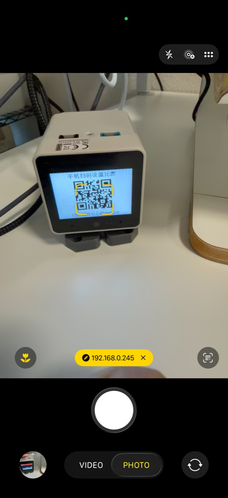
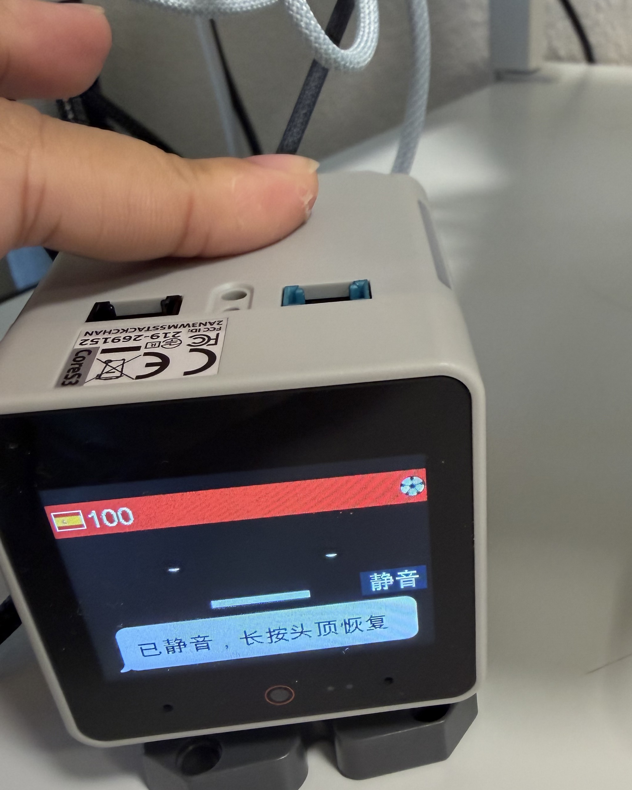

# Configuration and operation

[English](configuration.md) | [简体中文](configuration.zh-CN.md)

The phone setup page is the normal control surface. It changes all labels
immediately, persists its language on the device, and applies the selected
match, supported team, optional position, and commentary style through the
watcher's pending/ack flow. The watcher validates the ESPN/Kalshi pairing,
atomically updates its local JSON, hot-reloads, and acknowledges Stack-chan.

## Match Setup flow

1. Keep the watcher computer awake and the `--watch` process running on the
   same trusted LAN as the phone and Stack-chan.
2. Double-tap the three-zone touch bar on top of Stack-chan's head. A short
   Power-button press also toggles Match Setup on the pinned host firmware.
3. Scan the QR, choose 中文 or English, a match, supported team or Neutral,
   optional pregame position or No position, and a commentary style.
4. Tap **Start watching** and wait for watcher confirmation. No device or
   watcher restart is required.

Tap the touch bar once while the QR is visible to hide it. It closes
automatically after 90 seconds.

<table>
  <tr>
    <td align="center" width="38%">
      <br>
      <sub>Scan the on-device QR to open Match Setup on the local network.</sub>
    </td>
    <td align="center" width="62%">
      <br>
      <sub>Hold the top touch bar to mute sound, motion, and alert lights while visual updates continue.</sub>
    </td>
  </tr>
</table>

For a matched fixture, Match Setup enables the Kalshi market associated with
the selected position team. With No position, it enables the first market in
the match pair. A position is only a manual perspective; Matchday never reads
a Kalshi account.

## Configuration format

The top-level `language` is `zh` or `en`. User-facing values accept either a
legacy string or a localized object:

```json
{
  "language": "en",
  "mac_voice": {"zh": "Tingting", "en": "Samantha"},
  "espn": {
    "commentary_style": "balanced",
    "label": {"zh": "法国 vs 摩洛哥", "en": "France vs Morocco"},
    "team_names": {
      "France": {"zh": "法国", "en": "France"}
    }
  },
  "markets": [{
    "ticker": "KXEXAMPLE-FRA",
    "label": {"zh": "法国晋级", "en": "France to advance"}
  }]
}
```

Start from `config/kalshi_watchlist.example.json`, keep the untracked working
copy at `config/kalshi_watchlist.json`, and validate it with
`python3 -m json.tool` before starting the watcher.

The setup service normally binds `127.0.0.1:8788`; its `/setup` page is a local
admin fallback rather than the primary on-device QR flow. To expose that
optional page on a trusted LAN, explicitly set `setup_server.host` to
`0.0.0.0`; never port-forward it. The bundled server accepts IPv4 addresses
and hostnames, not IPv6 literals. Once per local day, the watcher can ask you
to scan and choose a match. Configure that behavior with
`setup_server.daily_prompt_hour` (`-1` disables it),
`prompt_minutes_before`, `quiet_hours`, and `lookahead_days`.

## Player catalog and naming

The watcher first consults `config/espn_player_catalog.json`, keyed by stable
ESPN athlete IDs such as `espn:362150`. Entries provide formal Chinese and
English names, manually verified casual nicknames, a featured-player flag,
and an optional goal chant.

`balanced`, `professional`, and every device balloon use the formal name.
Only casual speech may use a friendly nickname. Legacy per-match
`player_names` and `star_chants` remain supported and override the catalog;
custom goal-signal speech uses the same localized-leaf format.

An unmatched player falls back to ESPN's original name. The watcher does not
transliterate or invent a nickname. When an ESPN roster first appears or
changes, it logs named and featured coverage and the raw-name fallback list so
the catalog can be completed for a later match without blocking commentary.

## Commentary styles

`espn.commentary_style` is a persistent global preference with exactly three
values. If omitted, it defaults to `balanced`.

| Value | Voice | Device balloon |
| --- | --- | --- |
| `casual` | Friendly co-watching language with every core fact | Compact event summary |
| `balanced` | Clear, natural narration compatible with previous behavior | Compact event summary |
| `professional` | Core facts plus reliably parsed ESPN detail and football terminology | Compact summary; detail stays in speech |

Every style keeps match time, event type, team, required players, result, and
current score. Penalties, cards, and substitutions retain all necessary
participants. Suspected goals and events awaiting commentary confirmation stay
explicitly uncertain in every style.

Professional speech may add an assist or cross, shot type and body part, field
or goal location, goalkeeper save, set-piece position, or substitution/injury
reason only when ESPN explicitly supplies it and the watcher parses it
reliably. It never reads raw English commentary aloud or guesses missing
detail. Balloons normally remain “time + player/team + event + score,” with
only small punctuation or wording differences between styles.

The selected style also applies to match phases and results, Kalshi moves, and
suspected-goal alerts. It changes wording only: TTS voice and rate, sound
effects, celebrations, expressions, lights, priority, and alert switches are
unchanged. Switching during a match affects newly generated alerts without
replaying old ESPN events or resetting market baselines, queues, or polling.

## Support and position perspectives

The supported team defines everyday co-watching language. Routine shots,
saves, and corners do not force position commentary. Major events—goals,
penalties, red cards, and results—add whether the manually declared position
benefits or comes under pressure.

Aligned support and position are combined. A conflict explicitly separates
the emotional and position outcomes. Only a Kalshi market that Match Setup has
matched to the selected position and marked `tracks_position` uses position
wording for price changes or suspected goals. Unconfirmed events always retain
“if confirmed” or equivalent wording and wait for commentary confirmation.

## Polling, alerts, and quiet hours

Top-level `poll_seconds` is the base interval. `adaptive_polling` can use
different Kalshi and ESPN intervals when a match is distant, warming up,
approaching kickoff, live, or finished. During a live ESPN fixture,
`espn.poll_seconds` may be configured separately. Shorter intervals increase
load on the device and upstream services; they do not guarantee that upstream
data will appear sooner.

Common alert settings include:

- `max_alerts_per_cycle` — maximum alerts delivered in one polling cycle.
- `startup_summary_on_watch` / `speak_startup_summary` — startup summary and
  whether it is spoken.
- `display_refresh_seconds` — persistent-display refresh interval.
- `quiet_hours` — do-not-disturb period.
- `alert_balloon_seconds` — duration of ordinary alert balloons.
- Per-market `alert_move_cents`, `speak_move_cents`,
  `min_seconds_between_alerts`, and `alerts_enabled`.

The watcher can also prompt for a daily match selection:

- `setup_server.daily_prompt_hour` — local hour; `-1` disables the prompt.
- `setup_server.prompt_minutes_before` — pre-kickoff prompt window.
- `setup_server.lookahead_days` — fixture-discovery horizon.
- `quiet_hours` — suppresses proactive prompts at unsuitable times.

## Mute and other controls

Hold the top touch bar for about one second to toggle the boss-key mute.
Speech, tones, celebrations, and alert lights stop while the probability bar,
balloons, and ticker update silently. A corner `MUTE` / `静音` badge remains
until unmuted.

`mute on 60` sent to `/api/command`, or the control panel's **mute 60m** button,
starts a timed meeting mute and announces when sound returns. An indefinite
mute survives reboots. See the [Device API](device-api.md) for the complete
command examples.

## Standalone market mode

If no fixture is available, paste a Kalshi event URL or ticker into Match
Setup. The event's four most-traded markets appear in the bottom ticker.
Fixture-only flags, probability bar, and ESPN commentary are disabled until a
matched fixture is selected again.

## HTTP and serial transport

HTTP is the full workflow and uses Python's standard library. Phone setup,
device status detection, and the options/pending/ack relay require it.

Serial transport is intended for direct command and control only. Install
`pyserial` and set `stackchan_serial_port` if you use it; Match Setup relay and
status detection are unavailable over serial.
